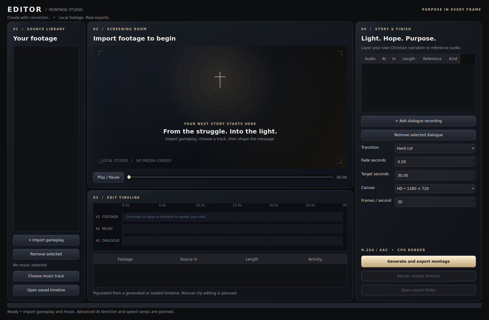

# Universal AI Gaming Montage Editor

A local, personal-use gaming montage engine. The first working vertical slice imports gameplay and music, measures activity and musical onsets, builds a deterministic timeline, exports a real MP4 and fully decodes it to validate the result.

Continue this project in Claude using [CLAUDE.md](CLAUDE.md) and the detailed [handoff](docs/CLAUDE_HANDOFF.md). The working application currently lives on `feat/working-montage-pipeline` in [PR #1](https://github.com/jdiller-arkhon/Editor/pull/1); `main` contains the initial foundation. Verify branch state before continuing.

## Current status

| Status | Features |
| --- | --- |
| IMPLEMENTED | CLI media import/probing, generic motion/audio activity scoring, non-overlapping clip selection, JSON timeline save/load/replay, lossless intermediate processing and single-delivery-encode H.264/AAC rendering, letterboxing, audio fades, gameplay mixing, measured two-pass loudness normalization, narration sidechain ducking, restrained zoom transitions, piecewise speed ramps, output validation, configuration, hardware/FFmpeg discovery, integration tests |
| EXPERIMENTAL | Opt-in Claude vision editor (`--claude-editor`): Claude reviews sampled frames of candidate moments, scores highlights, flags menus/loading screens and suggests story order; local engine keeps all timing. Mock-tested only; live quality unvalidated |
| EXPERIMENTAL | Measured beat grid (tempo, beats, 4/4 downbeat phase, four-bar/energy-change phrase marks, confidence) driving beat-aligned cuts, with spectral-flux attack pacing as the fallback; activity-based pacing/peak alignment. These are signal heuristics, not semantic game or song-structure understanding |
| PLANNED | Advanced desktop editing, semantic kills/events, game adapters, learned AI director, reference-style analysis, optical-flow transitions, smooth velocity curves, semantic sound design, GPU render validation, Windows installer |

This version provides a command-line engine and an initial desktop workspace; it is not a finished professional editor. It does not yet deliver the artistic judgment of a top montage editor.

## Requirements

Python 3.11+, NumPy 1.24–2.x, FFmpeg and FFprobe on PATH with libx264, FFV1, PCM and AAC encoding, plus xfade, drawtext and loudnorm filters. Windows 10/11 or Linux. No GPU, paid API or downloaded AI model is required. GPU discovery does not validate GPU rendering. Windows execution is not yet tested; Linux CPU rendering is tested. Use adequate disk space for temporary encoded clips and final exports. Analysis decodes low-resolution frames in 30-second chunks; long videos still take time and signal arrays scale with duration.

## Install and run

```sh
python -m venv .venv
# Windows PowerShell: .venv\Scripts\Activate.ps1
# Linux: source .venv/bin/activate
python -m pip install -e .
montage-editor doctor
montage-editor create --gameplay gameplay.mp4 another.mp4 --music song.wav --output exports/montage.mp4 --duration 30
montage-editor render exports/montage.timeline.json --output exports/revised.mp4
python -m unittest discover -s tests -v
```

Quote paths containing spaces. Install FFmpeg separately and verify `ffmpeg -version` and `ffprobe -version`. `--width`, `--height`, `--fps` customize exports; dimensions must be positive even integers. Inputs must be seekable local files supported by FFmpeg. Output must be a new `.mp4` path. Existing exports and project sidecars are never silently overwritten.

## Editing and exports

The renderer exports H.264 video (High: CRF 16 / slow; Master: CRF 12 / slow; Draft: CRF 23 / fast), AAC music (320 kbps), fixed dimensions and frame rate, preserving source aspect ratio with black bars. Gameplay audio is analyzed and can be mixed at a configurable gain. Simple mode uses 25% gameplay and 80% music before measured two-pass mastering toward −16 LUFS / −1.5 dBTP and a peak limiter. Narration ducks the music with attack/release smoothing. When the song has a confident steady beat, cuts land on tracked beats chosen by a global path that favours downbeats, phrase boundaries and 2/4/8/16-beat shots, with shorter shots in louder passages; otherwise clips cut near detected musical attacks. Activity peaks align to an interior (down)beat inside shots where source bounds permit. The automatic song excerpt starts on a measured phrase/downbeat when the beat grid is confident. The validation report's `music_alignment` records the pacing mode and measured cut-to-beat/downbeat/phrase alignment. The engine uses unused source intervals around activity candidates when necessary; requested duration may shorten when footage or music is insufficient. The validation report records shortening.

Outputs include `.timeline.json`, `.analysis.json`, and `.validation.json`. Timelines reference absolute local media paths; they do not embed media or upload it. You can edit a timeline JSON and replay it. Validation checks audio/video streams, dimensions, frame rate, duration and full decode; it does not assess artistic quality or accurately recognized gameplay events.

## Architecture and supported games

`src/montage_editor`: configuration, environment detection, CLI and analysis/director/render pipeline. `tests`: unit and actual FFmpeg render tests. `docs`: architecture, decisions, limitations and session log. `.github/workflows`: mandatory CPU integration CI.

Any game recording with a decodable video stream can use the generic engine. There are no game-specific adapters yet, including Siege. Future adapters will contribute scored event timestamps to the same candidate representation. No game is advertised as having semantic support.

Large assets belong outside Git. Local `assets/`, `models/`, `proxies/`, `cache/` and `exports/` are ignored. Never commit raw gameplay, songs, renders, caches, secrets or virtual environments. Small synthetic fixtures are generated during tests.

See [architecture](docs/ARCHITECTURE.md), [development](docs/DEVELOPMENT.md), [testing](docs/TESTING.md), [roadmap](docs/ROADMAP.md) and [development log](docs/DEVELOPMENT_LOG.md).

## Christian storytelling

The product direction includes contemporary Christian montages that encourage following Christ. `create --story story.json` now supports timed local dialogue recordings, signal-driven music ducking, mix limiting, and black/white fades and cinematic composited transitions. Dialogue references and original/paraphrase/quotation labels persist in project metadata. These controls are implemented; automated reference selection, scripture captions, narrative AI and studio-quality output remain goals. See [Christian storytelling](docs/CHRISTIAN_STORYTELLING.md) for configuration and creative direction.

## Desktop studio

```sh
python -m pip install -e '.[desktop]'
montage-studio
```

The PySide6 workspace offers native file import, preview/playback/scrubbing, real timeline inspection, editable dialogue cues and references, transition/export settings, background rendering and validated export preview. Dialogue Kind accepts `original`, `paraphrase`, or `quotation`; references are metadata, not captions. “Render loaded timeline” uses stored settings and dialogue; inspector controls apply to new generation. Render progress is indeterminate; there is no cancellation/resume yet. Close is blocked during an export.

Desktop controls are tested offscreen on Linux; physical audio playback and Windows execution remain unvalidated. Qt multimedia codecs/device support may differ from FFmpeg rendering. Advanced reference effects and manual clip editing remain planned. See [reference style brief](docs/REFERENCE_STYLE.md).



Linux desktop dependencies include `libegl1`, `libgl1`, `libopengl0` and `libpulse0` (Ubuntu packages). The desktop CI explicitly installs these; missing `libpulse0` caused the initial desktop run failure. Launch with `montage-studio` or `python -m montage_editor.desktop` after installing the desktop extra. The custom workspace now includes layered surfaces and actual timeline lanes. Timeline seeking applies to the rendered export, not unrendered source sequences.

The desktop uses layered graphite panels, restrained architectural texture, clear media intake and a real preview/timeline. Creative controls are hidden until needed. Analyze independently measures gameplay motion/audio and reports candidate activity (not kill confidence). The source library appears after import. AI Director opens local director settings.

## Automatic local AI director (experimental)

Select **Automatic • Ollama** in the desktop, enter an installed local model name and optionally a creative brief, then Generate. Or add `--ollama-model YOUR_INSTALLED_MODEL --brief "Cinematic Christian hope and perseverance"` to CLI create. Ollama ranks activity candidates and chooses pacing/supported transitions; the engine handles analysis, timeline, render and validation. Install Ollama and a local model separately. The activity baseline remains available without AI.

This integration is tested with mocked responses and real resulting renders; live model inference is not validated here. It receives metadata, not video frames, and cannot yet recognize events or create narration/advanced effects. See [AI pipeline](docs/AI_PIPELINE.md) for setup and exact limitations.

## Simple mode: drop, song, create

1. Drop gameplay clips anywhere in the desktop window (or use Import).
2. Type the song title. Choose your local music folder once, or drop the audio file too.
3. Click **Create montage**. DRIFT analyzes, directs, renders, validates and automatically saves a uniquely named MP4 under your system Videos/Movies folder in `DRIFT`.

Music matching uses local filenames (including artist/title words), not online streaming or downloads. Ambiguous matches offer a choice. Rename local music files descriptively. Matching is bounded to 10,000 folder entries; choose a focused music folder. Clip duplicates are ignored. Video/audio media validity is checked by the rendering engine after import.

Advanced controls are hidden by default. Select Ollama and its model once under Creative controls; mode/model, brief and music folder are remembered locally. With no model configured, the automatic activity engine remains available. The default Subtle tone emphasizes hope and perseverance with an editable original closing title, “Keep the faith.” Creative controls also offer an explicit Christian tone (“Walk with Christ.”) and Neutral tone without a default title. Custom closing lines persist across tone changes and restarts; clear the field to omit the title. It does not automatically generate spoken scripture or reference dialogue. Title rendering requires FFmpeg drawtext and an available font; Windows validation remains outstanding.

Kaiser-level creativity remains a development goal, not an implemented quality guarantee. Semantic visual analysis, smooth speed curves/subject-aware compositing, narration generation and iterative editorial evaluation are still needed.

## Cinematic edit profile

Simple mode enables restrained center zooms, occasional piecewise fast–slow–fast retiming,
source diversity and an activity-based build/resolve sequence. It keeps musical cut times fixed,
never repeats used footage and preserves pitch with `atempo` for gameplay audio. A quiet source
gets an explicit silent gameplay track while the real imported soundtrack remains audible.
Silent music is rejected. Timeline fields persist effects, mix gains and exact activity anchors.

CLI story JSON can opt in with `"edit_profile":"cinematic"`, `"transition":"zoom"`,
`"gameplay_gain":0.25`, `"music_gain":0.8`, `"normalize_audio":true`.
See [editing and audio](docs/EDITING.md) for constraints and quality checks.
These are tested editing tools, not verified studio-quality creative judgment.

## Composited transitions and export quality

Simple mode now defaults to Full HD and a cinematic mix of smooth pushes, zoom blends,
blur blends and directional transitions. Advanced controls offer each effect individually
plus dissolve. These actually blend two images around the existing cut; musical cut times
and total duration remain fixed. Brief held-frame handles avoid consuming extra source footage.

FFV1/PCM intermediates are lossless; one final H.264 encode uses the selected quality preset.
Lanczos resizing and BT.709 SDR delivery metadata are explicit. Known HDR sources are rejected
until tone mapping is implemented. Source size and upscaling are recorded in validation metadata:
1080p delivery of a smaller source cannot create native 1080p detail.
CLI supports `--quality high`, `--quality master` or `--quality draft`.
Lossless processing needs more temporary storage and CPU time. See [rendering](docs/RENDERING.md).

Quick-create can automatically choose an energetic excerpt of your selected local song.
The Advanced checkbox disables this when you want the original opening. Song selection remains
local filename matching; no songs are downloaded. The excerpt algorithm measures energy and
variation, not lyrical meaning or musical phrases. Its source offset persists in projects.
